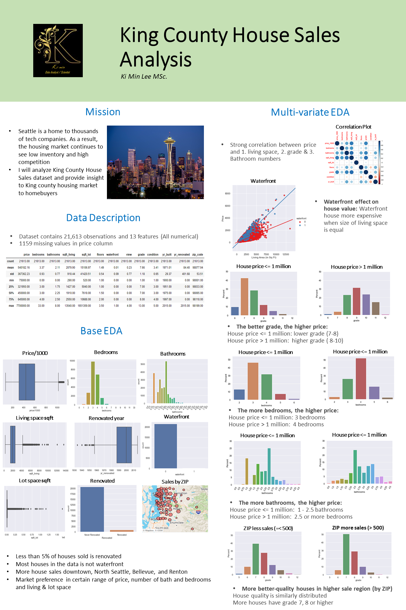

# House_Sale_King_County
Data Analysis on King County House Sales

## Executive Summary
Seattle home values have gone up over the past year and are expected to continue rising in the next years. I extract informative findings from King county house sales dataset over the past years and aim to provide insight with EDA to future homebuyers of Seattle and newcomers to the city.

# Languages & Libraries
* Python
  * numpy
  * pandas
  * seaborn
  * matplotlib
* R
  * tidyverse
  * ggplot2
  * gridExtra

# Technical Appendix
* [Python Notebook](https://github.com/kilee722/House_Sale_King_County/blob/main/Hous_Sales_EDA_R.Rmd)
* [R Markdown](https://github.com/kilee722/House_Sale_King_County/blob/main/House_Sale_EDA.ipynb)
